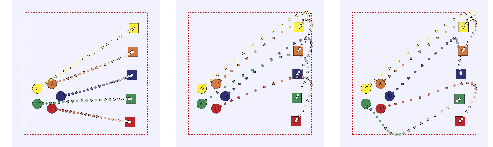

# Multi-vehicle trajectory planning with &Pi;net 
GLITCH stands for Generative Light-Transition Choreography Hub (tbh, it's a made up acronym). But this repo contains code for conditional generation of transitions for swarm of robots, showcasing an application of &Pi;net.

[](https://arxiv.org/abs/TODO)


We use &Pi;net to synthesize in milliseconds transition trajectories between multi-vehicle configurations that optimize some non-linear, *fleet-level* objective subject to dynamics, state and input constraints. We feed a neural network with the initial and terminal fleet configurations (the context $\mathrm{x}$), obtain the raw input trajectories and use the vehicle dynamics to infer the full state-input trajectories that serves as the raw output $y_{\text{raw}}$, which are then projected for ensured constraint satisfaction.


## Using &Pi;net is easy

Let $p_i[t] \in \reals^m$ be the generalized coordinates of vehicle $i$ at the discrete times $t \in \{1, \ldots, T\}$, 
and $v_i[t]$ and $a_i[t]$ its generalized velocity and acceleration. 
Its simple discretized dynamics read $v_i[t + 1] = v_i[t] + h a_i[t]$, $p_i[t + 1] = p_i[t] + h v_i[t] + \frac{h^2}{2}a_i[t]$.

We formulate the motion planning task for the fleet as a parametric program,
$$     \underset{ y }{\mathrm{minimize}}
    \quad \varphi(y, \mathrm{x})
    \quad
\mathrm{subject~to} \quad
y \in \mathcal{C}(\mathrm{x}), $$
where $\mathcal{C}(\mathrm{x})$ includes box constraints on positions (workspace constraints), velocities, and accelerations (physical limits), 
affine inequality constraints for jerk limits, and equality constraints for the dynamics and initial/final configuration *for each vehicle*. 
The objective function $\varphi$ encapsulates a *fleet-level* objective, see [results](#results) for different objective functions we considered.

We specify the constraints in [constraints.py](./src/glitch/definitions/constraints.py). For instance, the jerk constraints are affine inequality constraints:

```python
C = get_jerk_matrix(
    horizon=horizon,
    n_states=n_states, 
    n_robots=n_robots, 
    h=h
)
lb = config.get("lower_bound", -1) * jnp.ones((C.shape[0], 1))
ub = config.get("upper_bound", 1) * jnp.ones((C.shape[0], 1))

ineq = AffineInequalityConstraint(
  C=C[None, ...],     # We construct each of these matrix/vectors unbatched,
                      # whereas pinet works batching.
  lb=lb[None, ...],
  ub=ub[None, ...],
)
```

Working space constraints, velocity and acceleration constraints are box constraints:
```python
box = BoxConstraint(BoxConstraintSpecification(
  lb=lb[None, ...],   # lb and ub are the bounds obtaining by 
                      # taking the minimum/maximum
                      # of the various constraints
  ub=ub[None, ...],
))
```

The dynamics constraints and the initial and final position constraints can be specified via affine equality constraints:
```python
A_initial_states = get_initial_states_extractor(
    horizon=horizon,
    n_states=n_states,
    n_robots=1, # We can decouple the constraints among the robots
)
A_final_states = get_final_states_extractor(
    horizon=horizon,
    n_states=n_states,
    n_robots=1, # We can decouple the constraints among the robots
)
A_inputs = get_input_extractor(
    horizon=horizon,
    n_states=n_states,
    n_robots=1, # We can decouple the constraints among the robots
)
A, B = get_dynamics(
    horizon=horizon,
    n_states=n_states,
    n_robots=1, # We can decouple the constraints among the robots
    h=h,
)
A_dynamics_outputs = get_dynamics_outputs_extractor(
    horizon=horizon,
    n_states=n_states,
    n_robots=1, # We can decouple the constraints among the robots
)
A_eq = jnp.concatenate((
    A_initial_states,
    A_final_states,
    A @ A_initial_states + B @ A_inputs - A_dynamics_outputs,
), axis=0)
eq = EqualityConstraint(
    A = A_eq[None, ...],
    b = jnp.zeros((1, A_eq.shape[0], 1)), # b is considered variable anyway
    method=None,  # We tell pinet to not pre-compute linear systems solutions.
                  # Since we have inequality constraints, 
                  # we will need to lift the constraints and pre-computation
                  # would be wasted.
    var_A=False,  # A is constant for the whole problem
    var_b=True    # We may need to solve for different initial and terminal states
)
```

We then instantiate the projection method:
```python
project = Project(
  box_constraint=box,
  ineq_constraint=ineq,
  eq_constraint=eq,
  unroll=config_hcnn["unroll"],
)
```
&Pi;net, internally, will lift the constraints and put them in an efficient form. To introduce pinet in the neural network, see [nn.py](./src/glitch/nn.py). Briefly, we make sure that after our backbone network (either a CNN or a simple MLP) we have a layer outputting `n_inputs` values,
```python
u = nn.Dense(n)(x)[..., None]
```
where `n` is `n_states * n_robots * horizon`.

Then, we can compute the state evolution as
```python
x_all = jax.vmap(lambda _x, _u: A @ _x + B @ _u)(x0, u)
p_all = x_all[:, :n, :]
v_all = x_all[:, n:, :]
```
After preparing the variable `b` for the affine equality constraints and reformatting the state `x` in the same format as specified in the constraints
```python
b = prepare_b_from_batch(n_eq, initial_states_batched, final_states_batched)
x = predictions_to_projection_layer_format(x_all)
```
we project the prediction onto the constraints:
```python
yraw=ProjectionInstance(
  x=x[..., None], eq=EqualityConstraintsSpecification(b=b)
)
x = self.project.call(
  yraw=yraw,
  sigma=sigma, 
  omega=omega,
  n_iter=n_iter,
  n_iter_bwd=n_iter_bwd
)[0].x[..., 0]
```

## Results

Here, we explain how to reproduce the results in the [paper](https://arxiv.org/abs/TODO).

> [!TIP] With Docker 🐳
> Below we provide the commands without the docker container, but to run it within a Docker container you can use
> ```bash
> docker compose run --rm glitch-cpu the-command # run on CPU
> docker compose run --rm glitch-gpu the-command # run on GPU
> ```
> instead of 
> ```bash
> python the-command
> ```

### Workspace coverage, input effort and trajectory preference from a potential function
The objective is to minimize
\[
\varphi(y) = \texttt{effort}(y) + \lambda \cdot \texttt{preference}(y) + \nu\cdot \texttt{coverage}(y)
\]
where $\texttt{effort}(y)$ describes the input effort of the solution $y$, 
$\texttt{preference}(y)$ describes the fitness of $y$ with respect to a spatial potential $\psi$, 
and $\texttt{coverage}(y)$ describes the fraction of the workspace that the agents cover over time, 
and $\lambda, \nu \geq 0$ are tuning parameters. For details, please refer to the code or paper. You can tune these parameters in [dataset.yaml](./configs/dataset.yaml):
```yaml
input_effort: 0.0 # 1.0
fleet_preference: -1.0 # -1.0
agent_preference: 0.0 # 0.05
```

To run this example, you can use 
```bash
python -m src.main --train --config-hcnn configs/hcnn.yaml --config-dataset configs/dataset.yaml
```
You can plot different trajectories by specifying the `--plot-trajectories 1 2 n3 n4 ...` argument. Below, from left to right, we show the results with only `input_effort`, with `input_effort` and `fleet_preference`, and with all of the three terms non-zero.





You can also plan with more vehicles by increasing the `n_robots` value in `dataset.yaml`:
```yaml
n_robots: 25 # before: 5
```


### Contextual coverage and longer horizon

In the next example, we explore how &Pi;net handles:
- very high-dimensional context size (in the millions of variables); and
- a large number of optimization variables and constraints (in the tens of thousands).

For this, we focus on a single vehicle with the same constraints as before, increase the horizon length, and consider as cost function the average along the trajectory of the value assigned (via bilinear interpolation) to the position of the vehicle by a discrete map $\mathrm{m}$ of resolution $\texttt{res}\times\texttt{res}$. Thus, the context $\mathrm{x}$ corresponds to the initial and final location as well as the map $\mathrm{m}$. For details, please refer to the code or paper.

We consider two cases:
- $H = 100$, $\texttt{res} = 1024$, $D = 4$. In this case, we evaluate if &Pi;net enables training end-to-end of neural networks with constraints even when the context is very high-dimensional (for a comparison, DC3 considers a context of dimension $50$).
```bash
python -m src.main --train --config-hcnn configs/hcnn_context.yaml --config-dataset configs/dataset_large_context.yaml
```
- $H = 750$, $\texttt{res} = 64$, $D = 2$. In this case, we evaluate &Pi;net for a context of size similar to that typical of, e.g., reinforcement learning settings and a number of optimization variables and constraints two orders of magnitude larger than state-of-the-art parametric optimization algorithms (for instance, DC3 considers $100$ optimization variables, and $50$ equality and inequality constraints).
```bash
python -m src.main --train --config-hcnn configs/hcnn_context.yaml --config-dataset configs/dataset_long_horizon.yaml
```
As before, you can use the option `--plot-trajectory` to save some trajectories at the end of the episode.